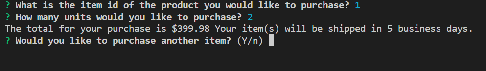

# Bamazon

In this activity, I created an Amazon-like storefront with MySQL. This app is ran on the node command line. The app will take in orders from customers and deplete stock from the store's inventory.

The following images show what comes up when node.bamazonCustomer.js is ran on command line.

